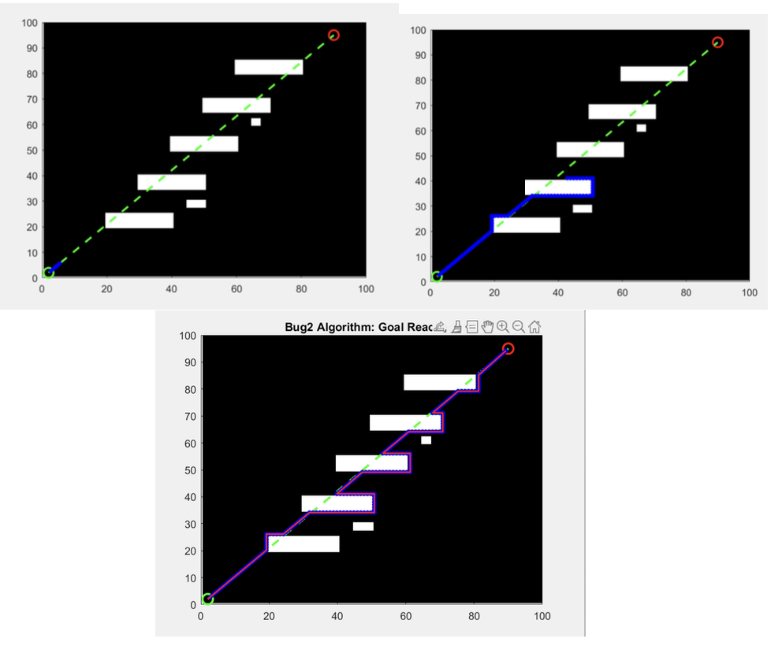

# Bug 2 Algorithm - Motion Planning in MATLAB  

## 📝 Description  
This project implements the **Bug 2** motion planning algorithm using MATLAB. The algorithm is designed for autonomous navigation, allowing a robot to move toward a goal while avoiding obstacles by following their boundaries.  

## 🚀 Features  
- Path planning with **Bug 2 Algorithm**  
- Obstacle detection and boundary following  
- MATLAB-based visualization of the robot’s movement  
- Simple and efficient implementation  

## 📌 How It Works  
1. The robot moves in a straight line toward the goal.  
2. If it encounters an obstacle, it follows the boundary until it finds a **leave point** (a point closer to the goal than where it hit the obstacle).  
3. The robot resumes moving toward the goal after passing the obstacle.  

## 🖼 Example Output  
Below is a visualization of the Bug 2 algorithm in action:  

